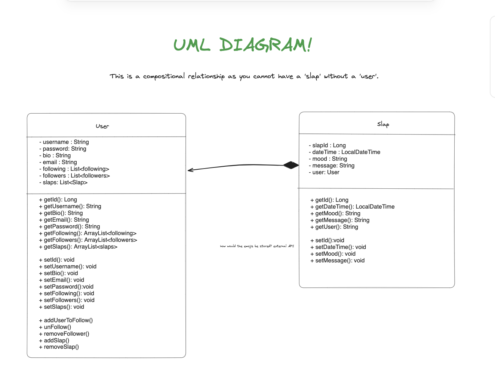
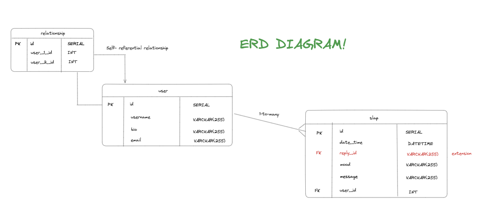

# The Slap (Server-side)

## **TABLE OF CONTENTS** 📖

> 1. Project Overview
> 2. Diagrams
> 3. Tech Stack
> 4. Set-Up Instructions
> 5. RESTful Route Endpoints
> 6. Future Developments
> 7. Collaborators

### **_1. Project Overview_**
As part of our capstone project, our team created an API and the UI for the app in 10 days. Our group decided to build on the nostalgic social media platform 'TheSlap.com' as seen on the show Victorious. The Slap is a modern social media platform reminiscent of MySpace, designed with the user in mind to share their thoughts and feelings with the world.

### **_2. Diagrams_**

#### UML diagram

#### ERD diagram

### **_3. Tech Stack_**

Tech stack for the back-end:

* Java `version: 17`
* Spring Boot `version: 3.0.6`
* PostgreSQL 
* Maven

Dependencies: `Lombok`, `Spring Data JPA`, `Spring Web`, `Spring Boot DevTools`, `PostgreSQL Driver`

### **_4. Set-Up Instructions_**

Ensure the following is installed on your device:

* Intellij IDEA (running with JDK 17)
* PostgreSQL
* Postman
* Postico (optional - to visualise the data)

1. Clone the repository from GitHub. Scroll to the top of this page and click on the green 'Code' button. Ensure SSH is selected and copy the link provided. In your terminal, `git clone` the SSH key.

2. Create a local postgresql database called `the_slap_db`. In the terminal run: `createdb the_slap_db`

3. Via Intellij IDEA, run the `Capstone_Slap_Server` and make sure the API is running on port 8080.

4. The client-side of the project can be found [here](https://github.com/nasthasiausoh/Capstone_Slap_Client)

To ensure the endpoints are working as expected, you can test them using Postman. All endpoints are available below in section 5 'RESTful Route Endpoints'.

### **_5. RESTful Route Endpoints_**

### User Controller

| Route Name             | Request Type | RequestBody                      | Request Path              |
|------------------------|--------|----------------------------------|---------------------------|
| `getAllUsers`            | GET    | null                             | `/users`                    |
| `getUserById`            | GET    | null                             | `/users/{id}`               |
| `getUserFollowing`       | GET    | null                             | `/users/{id}/followers `   |
| `getUserFollowers`       | GET    | null                             | `/users/{userId}`          |
| `createAuthenticatedUser`| POST   | `UserDTO` (username, bio & email)| `/users`                    |
| `loginUser`              | POST   | `LoginDTO` (email & password)    | `/users/login`               |  
| `updateUser`             | PATCH  | `UserDTO` (username, bio & email)| `/users/{id}`               |    
| `updateUserAddFollowing` | PATCH  | null                             | `/users/{userId}/following/{followingId}` |
| `updateUserUnfollowing`  | PATCH  | null                             | `/users/{userId}/unfollowing/{unfollowingId}`|  
| `deleteUser`             | DELETE | null                             | `/users/{id}`             |  

### Slap Controller
| Route Name             | Request Type | RequestBody                      | Request Path                                    |
|------------------------|--------------|----------------------------------|-------------------------------------------------|
| `getAllSlaps`            | GET          | null                             | `/slaps`                                    |
| `getSlapById`            | GET          | null                             | `/slaps/{id}`                                |
| `getSlapsByUserId`       | GET          | null                             | `/slaps/slapFromUser/{userId}`               |
| `createSlap`             | POST         | `SlaproomDTO` (dateTime, mood, message & userId) | `/slaps`                   |
| `updateSlap`             | POST         | `SlapDTO` (dateTime, mood, message & userId)      | `/slaps/{id}`              |
| `deleteSlap`             | DELETE       | null                             | `/slaps/{id}`                      

### **_6. Future Devlopments_**

1. Enable users to upload images and videos as slaps
2. Allow users to reply to slaps
3. Utilise a database (such as AWS) to store songs, videos and pictures

### **_7. Collaborators_**

* GitHub: [Nasthasia Usoh](https://github.com/nasthasiausoh)
* GitHub: [Rada Kanchananupradit](https://github.com/R08K09)
* GitHub: [Subrina Faisal](https://github.com/Subrina7)
* GitHub: [Zaynah Sadiq](https://github.com/Zaynah99)

